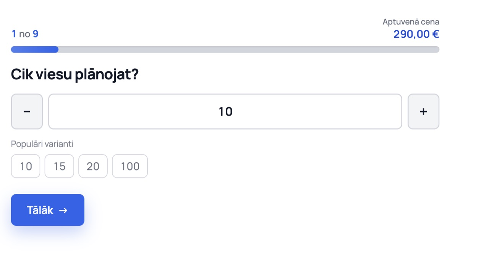
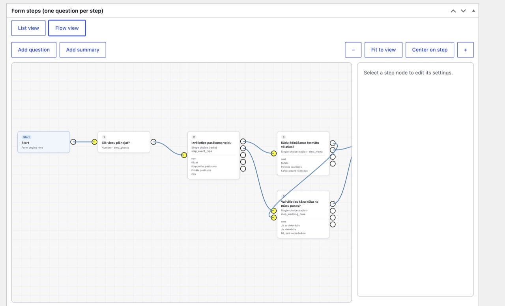
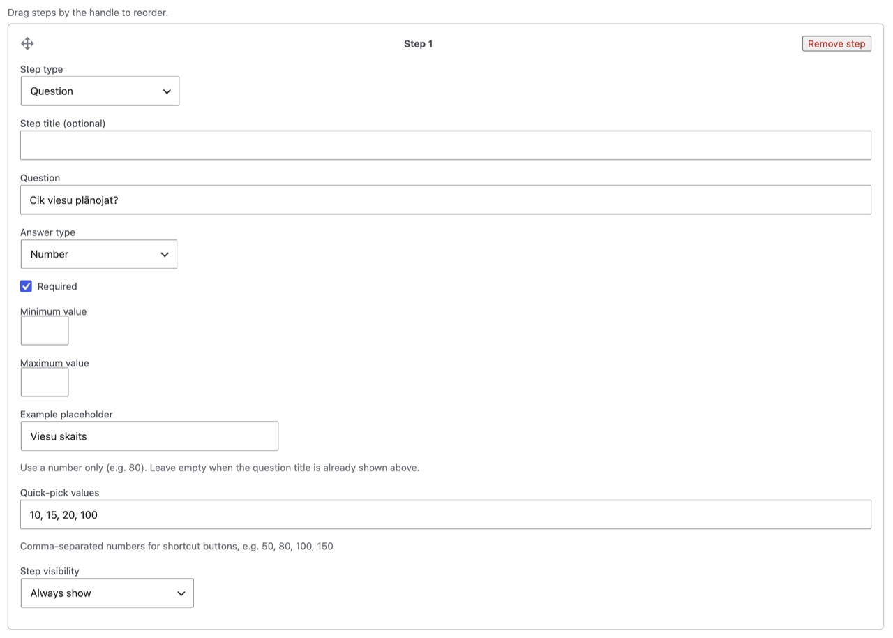

# MSF calculator — reference screenshots

Screenshots for the **Banketu kalkulators** form (`#msf-form-3247`) on [janoga.lv/calculator](https://www.janoga.lv/calculator/).

Images are resized to a max width of **1280px** and saved as JPEG (~82% quality) for faster loading in the repo.

| File | Original | Optimized | Description |
|------|----------|-----------|-------------|
| `1.jpg` | 85 KB (1472×820) | 52 KB | Front-end — step 1, guest count |
| `2.jpg` | 319 KB (2598×1576) | 102 KB | Admin — flow builder view |
| `3.jpg` | 210 KB (2424×1732) | 82 KB | Admin — step 1 settings (number field, quick picks) |

**Total:** ~614 KB → **~236 KB** (about 62% smaller).

---

## 1. Front-end — guest count step

Mobile/desktop form UI: progress (`1 no 9`), price bar, number input with +/- and quick-pick buttons.

---

## 2. Admin — flow builder

Branching logic after “Izvēlieties pasākuma veidu” (wedding vs corporate paths).

---

## 3. Admin — step configuration

Step 1 builder: number type, placeholder, quick-pick values (`10, 15, 20, 100`).

